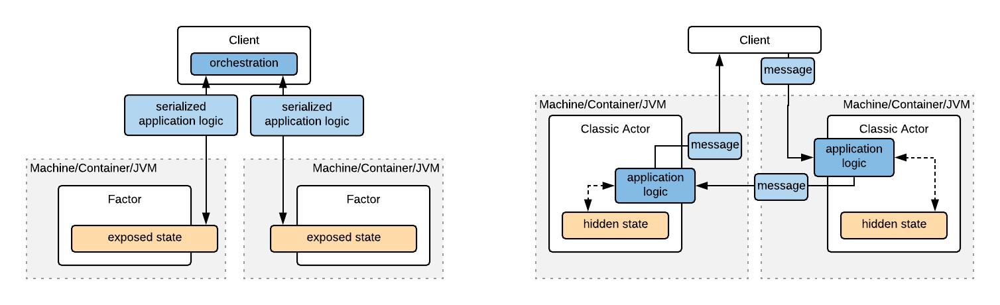
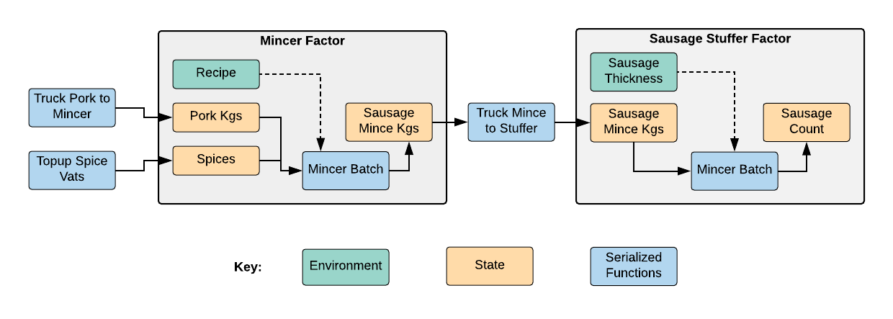

## Factor: An experiment in Functional Actors

[](https://travis-ci.org/benhutchison/factor)
[](https://maven-badges.herokuapp.com/maven-central/com.github.benhutchison/factor_2.12)

Factor is an experimental Scala API layer built on top of
[Akka](https://doc.akka.io/docs/akka/2.5/guide/introduction.html) and [Cats Effect](https://typelevel.org/cats-effect/)
that offers a significantly different programming model to classic actors.

Instead of sending a *message* to an actor who then interpret it, a _Factor_ ("functional actor") is sent an effectful
function to be run asynchronously in its process and on its state. The factor then replies with a value sent back to the
caller.

If classic actors extend the ideas of message-passing object-orientation into a concurrent, distributed context, then
Factor could be described as extending the Haskell-style applying functions over exposed data types into a distributed
scenario.

Factor reuses the quality engineering of Akka to power its distribution mechanism, but turns the user-programming model on its head.

### SBT Coordinates

```
"com.github.benhutchison" %% "factor" % "0.1"
```
Factor is published for Scala 2.12.

### API Overview

### Imports Guide

```scala
//Factor library itself
import factor._
//for specifying timeout durations
import scala.concurrent.duration._
//for IO
import cats.effect._
//to enable IO operations such as `sequence`, `void`
import cats.implicits._
```
While Akka is used internally, its imports are not required for regular usage.

#### Factors

A *Factor* is an active, potentially remote container for some state `S` and an environment (or configuration) of type
`E`. To program a factor, the programmer *sends a function* to the factor to be run asynchronously; the state of the
factor is updated, and a reply is sent back.

Factors are not accessed directly, but via a `FactorRef[E, S]` which are serializable, remote handles to a Factor. The
fundamental operation they provide is to asynchronously run an effectful (ie potentially side-effecting) function inside
the actor, and return a response to the caller wrapped in
[`cats.effect.IO`](https://typelevel.org/cats-effect/datatypes/io.html):

```scala
trait FactorRef {
  def run[A](f: (E, S) => IO[(S, A)])(implicit timeout: FiniteDuration): IO[A]
}
```

That is, the passed function can read the current environment and state, and can respond with new state, and a reply `A`.
The reply is returned asynchronously inside an `cats.effect.IO`. Note the passed function, any values it has "closed over",
and the reply value must be `Serializable`.

A number of variants of this primitive operation are built on top of it:

* `runPure[A](f: (E, S) => (S, A))(implicit timeout: FiniteDuration): IO[A]`: The sent function is pure.
* `runS[A](f: (S) => IO[(S, A)])(implicit timeout: FiniteDuration): IO[A]`: The sent function reads the Factor state but not environment.
* `runSPure[A](f: (S) => (S, A))(implicit timeout: FiniteDuration): IO[A]`: A pure function reads the Factor state but not environment.
* `runUpdatePure(f: (E, S) => S)(implicit timeout: FiniteDuration): IO[Unit]`: A pure function updates the state.
* `runSUpdatePure(f: (S) => S)(implicit timeout: FiniteDuration): IO[Unit]`: A pure function reads only the Factor state and updates the state.
* `getS(implicit timeout: FiniteDuration): IO[S]`: read and return the current state.
* `putS(newState: S)(implicit timeout: FiniteDuration): IO[Unit]`: set the current state
* `getE(implicit timeout: FiniteDuration): IO[E]`: read the environment or configuration.

In the event of a reply not received within the `timeout`, the `IO` will complete with a `FactorTimeout` runtime exception.

#### Creating or Obtaining a FactorRef

Each system that is going to host or call Factors needs to first start a `FactorSystem` which wraps an underlying Akka
`ActorSystem`.

```scala
val myAddress =  SystemAddress("MySystemName", "127.0.0.1", 3456)
val system = new FactorSystem(address)
```

Then a Factor may be created in a local or remote system via a `createFactor` call:

```scala
type E = String
type S = Int
val ref: FactorRef[E, S] = system.createFactor[E, S](
      "immutable Factor environment or config value",
      initialState = 1,
      "name of the factor",
      localOrRemoteAddress
    )
```

The recommendation is to create a factor ref and then pass it to any processes that need to interact with the Factor.

However, if you need obtain a ref to a Factor you somehow know exists, but didn't create, you can use `findFactor`. Be
warned that this lookup will not verify the types `E` and `S` you specify actually match those of the looked-up Factor
(think of them as an assertion you make using some external knowledge):

```scala
val ref: FactorRef[E, S] = system.findFactor[E, S](
      "name of the factor",
      localOrRemoteAddress
    )
```

#### Running a Computation

Factor inherits `IO`s deferred execution behavior. That is, the structure of a computation is declared, and then it is
triggered, typically once at the "end of the world" (ie program), using eg `runUnsafeSync`. See the
[example code](./example/src/main/scala/factor/example/SausageFactoryExample.scala) for an sample.

#### Termination

Factors persist until they are stopped. `stop` on `FactorRef` will stop a Factor, while `terminate` on `FactorSystem` will
terminate the whole system on that machine including all Factors.

#### Coordinating Multi-Factor Computations

A key aim of the Factor model is to allow a distributed actor system to be coordinated like a chain of local asynchronous
`Futures`, `IO`s or `Task`s, by using monadic flatMap/binds to sequence steps in a multi-part computation.

`IO` also provides good support for running parallel computations. For example, you can dispatch two calls to two
factors concurrently using `IO.parTraverse(f1, f2)` and continue when the results from each are back.

Keep in mind that calls to a Factor can be effectful, so they can read or write to databases, message queues, the cloud,
etc as well as manipulating the `Factor` state. Sometimes the goal of a call is to cause effects, and the Factor state
is just a book-keeping track the status of effects.

##### `runAsync` for Remote Orchestration

Another operation in the factor API exists to support orchestrating asynchronous calls and/or external effects remotely:

```scala
case class FactorSystem {
  def runAsync[A](f: ()=>IO[A], address: SystemAddress)(implicit timeout: FiniteDuration): IO[A]
}
```

This will run a potentially async, slow or effectful operation on the `address` specified, but outside of any Factor. An
ephermal one-shot Akka actor is created to run the `f` and then auto-disposed. It allows the control of a computation to
migrate to another machine, either so chatty interactions Factors are fast local calls, or because external asynch calls
should happen there.

The reason `runAsync` exists is that operations run inside a `Factor` should be brief and _blocking_. While processing a
message, you can think of that message as having an exclusive lock to see and update the state of the actor. In Factor,
the messages are pieces of runnable code. But if that code makes a non-blocking asynch call and then exists the message
handler, its forfeited its right to update the actor state when the async call comes back.

I know its unfashionable to advise synchronous code in 2018, but the reality is that the Actor model is built on an
requirement that message processing is synchronous.

### Factor & Classic Actors Compared

Compared to classic actors, Factor takes a different position on *encapsulation & data hiding*. Factor exposes the state
of its actors as a core feature of the programming model. This supports the capability to send mobile code from
afar into a factor to be run.

In contrast, classic actors follow the object-oriented tradition of hiding the state of actors away and exposing only a
set of messages, to indirectly manipulate the state.



Over the past 30 years or so, much has been written of the *benefits* of encapsulation; too much perhaps, so that the
*costs* of encapsulation have seen too little recognition or discussion. My own background started in object-oriented
Java, and the need for encapsulation had been drummed into me for years. I distinctly remember being quite surprised
when I first studied Haskell, that idiomatic Haskell programming style chose exposed- over encapsulated- data, and
what's more, they seemed to get along just fine!

So what are the trade offs? When we encapsulate, we protect ourselves against the unstable or untrusted outside world.
But this comes at the cost of maintaining a hidden internal state, plus an exterior API, and a means of translating
messages into state changes and back again. And this is a good approach when the outside world is unstable or untrusted.

But in many scenarios, we control the actor's environment ourselves. We have a system composed of many actors that we
have fashioned to work together. Just as we normally wouldn't keep the interior doors in our house locked, erecting
walls inside our system just adds overhead and complexity we don't want or need.

When you have a coherent system that needs to include distribution and concurrency, Factor can let your express your
system's behavior more clearly and concisely. You can write all your code in one place, declaratively describe which
parts should execute where, and you'll typically expend less effort on packaging and distribution overheads.

### Serialization

Factor is built on top of Akka and uses it's [serialization](https://doc.akka.io/docs/akka/current/serialization.html)
for transporting functions and data across the network. This delegates to Java's inbuilt serialization

A common gotcha when serializing functions is closing over, or capturing references to, values in the callers context
that are not serializable. Lets look at a simple example of how this happens:

```scala
class NonSerializablePredicate {def isLucky(n: Int): Boolean = n != 13}
val p = new NonSerializablePredicate

system.createFactorS[Int](7, "example", anAddress).runSUpdatePure(n => if (p.isLucky(n)) n else 0)
```

In the closure passed to the Factor, value `p` has been captured and must be serialized. A runtime exception will be
thrown here because `p` isn't `Serializable`.

### [Example](.example/src/main/scala/factor/example/SausageFactoryExample.scala)

The sausage factory example shows a working Factor system.



It includes [unit tests](./example/src/test/scala/factor/example/SausageFactorySpec.scala) and a
[unit-integration](./integrationTest/src/multi-jvm/scala/factor/integrationtest/SausageFactoryTest.scala) test which
starts 3 JVMs to run the system in full distributed mode.

Note the example also uses [Monocle lenses](http://julien-truffaut.github.io/Monocle/) for elegant updates to immutable data

### Status & Roadmap

Factor is currently an experiment. Source compatiblity may break between releases. Your feedback on the APIs or desirable
features is welcome.

Once I get accumulate sufficient experience using Factor myself, and gather some feedback from other users, I intend to
publish a stable version.

Features I am planning or considering adding to Factor:

* Machine checked docs
* Kryo as the default serialization mechanism
* Asbtract away from IO to the Cats Effect typeclasses

## Contributing

At this stage, user feedback, features requests and problem reports are particularly useful.

Contributions that are aligned with the design intent of the library are welcome. Go ahead and send PRs for minor changes,
but please raise an issue first for any major feature or change.
